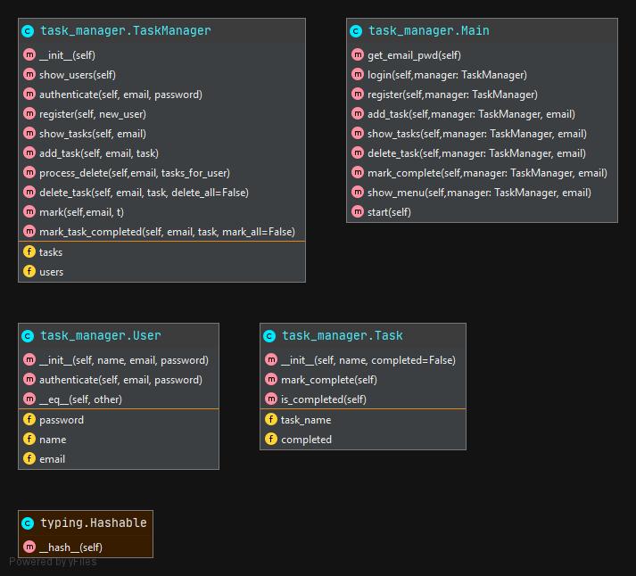
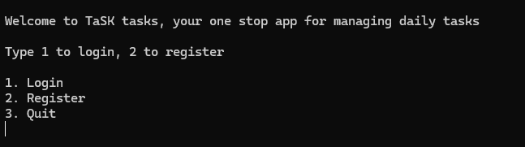
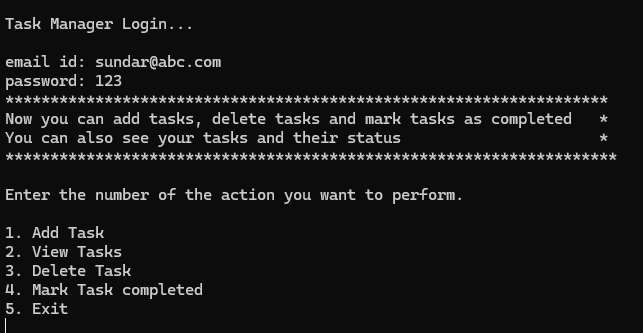
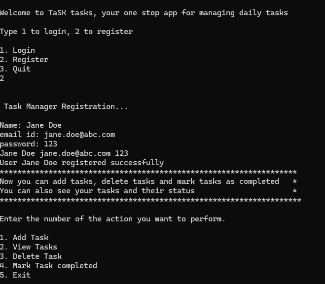
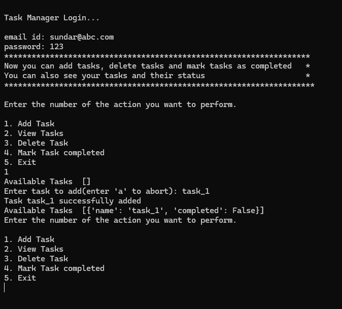
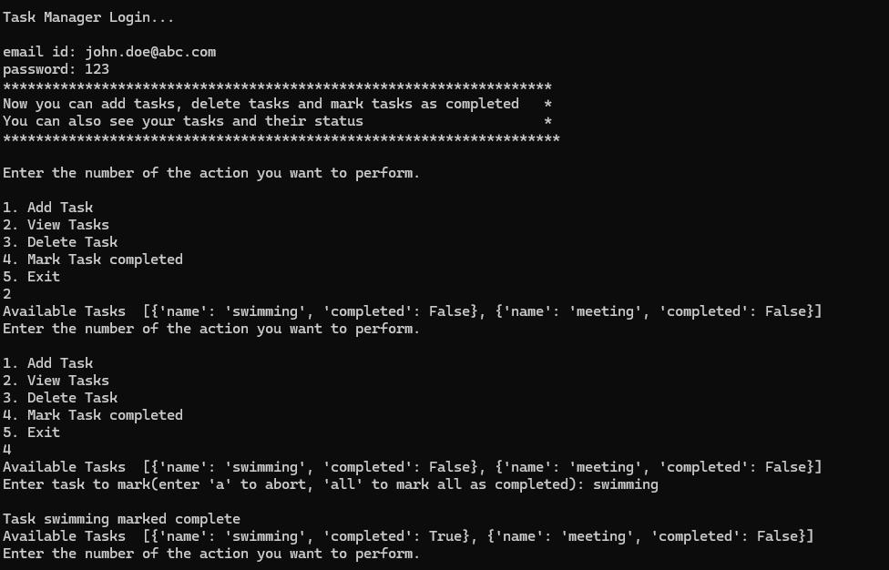
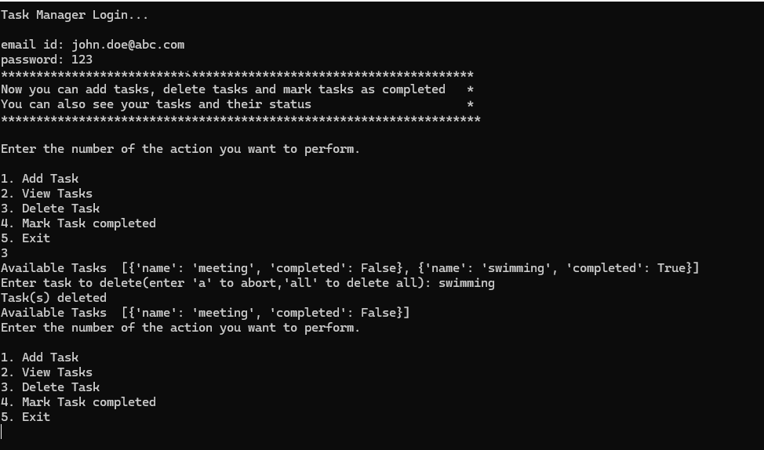

## Task Manager

### Use Cases:

1. User registration
2. User Login
3. User authentication
4. User can add a task
5. User can delete a task or delete all tasks created by him
6. User can view his/her tasks
7. User can mark a task as complete or mark all tasks as complete

Class Diagram

 

### User Interface ###

User inter face is designed  as a CLI using just print statements. This may be enhanced to a GUI later.
Some screenshots of the various use cases are given below

### Opening screen ###

 

### login screen ###

### Registration Screen ###

### Add Task Screen ###

### View and Mark Tasks Screen ###

### Delete Task Screen ###

